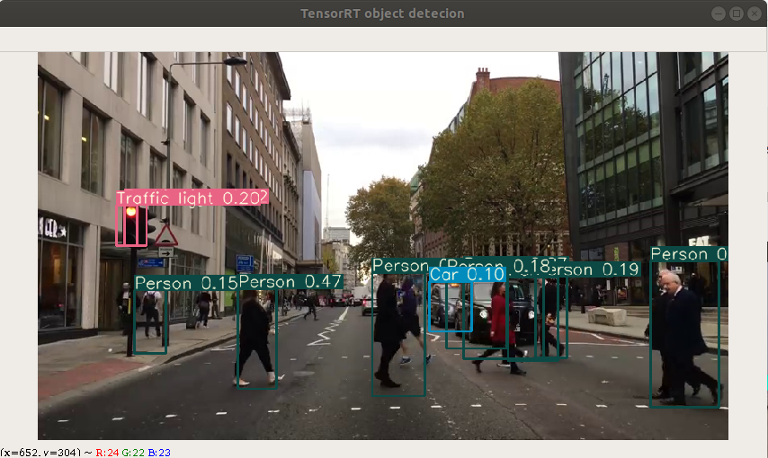

# 프레임워크 셋팅 및 동작

본 프레임워크는 다음과 같은 환경에서 동작한다 

- Ubuntu 18.04
- CUDA Toolkit 11.4 with the 470.103.01 version of the Nvidia Driver
- Python 3.8
- GPU : NVidia rtx 2080 ti (8GB)

본 문서에서는 프레임워크 동작을 위한 2가지 환경 셋팅 방법을 소개한다.

첫번쨰로 docker container 상에서 동작하는 방법과 

두번째로 로컬 환경에서 개발 환경을 셋팅하는 방법을 설명한다.

## [ Docker container 기반 프레임워크 동작 ]

### Nvidia-docker 설치

---

**저장소 및 GPG 키 설정** 

```bash
$ distribution=$(. /etc/os-release;echo $ID$VERSION_ID) \
   && curl -s -L https://nvidia.github.io/nvidia-docker/gpgkey | sudo apt-key add - \
   && curl -s -L https://nvidia.github.io/nvidia-docker/$distribution/nvidia-docker.list | sudo tee /etc/apt/sources.list.d/nvidia-docker.list
```

**Nvidia-docker 설치**  

```bash
$ sudo apt-get update
$ sudo apt-get install -y nvidia-docker2
```

**Docker 서비스 재시작** 

```bash
$ sudo systemctl restart docker
```

**Docker 설치  테스트** 

- 우분투 18.04 이미지를 기반으로 컨테이너를 실행해서 제대로 설치가 되었는지 테스트가 가능하다. 다음과 같은 명령어를 통해 테스트 가능하며 아래와 같은 결과가 나오면 docker 설치가 제대로 완료된것이다.

테스트 코드: 

```bash
$ docker run --rm --gpus all ubuntu:18.04 nvidia-smi
```

결과: 

```bash
(base) jacky@jacky-X570-AORUS-ELITE:~$ sudo docker run --rm --gpus all ubuntu:18.04 nvidia-smi
Unable to find image 'ubuntu:18.04' locally
18.04: Pulling from library/ubuntu
40dd5be53814: Pull complete 
Digest: sha256:d21b6ba9e19feffa328cb3864316e6918e30acfd55e285b5d3df1d8ca3c7fd3f
Status: Downloaded newer image for ubuntu:18.04
Sat May 14 10:26:46 2022       
+-----------------------------------------------------------------------------+
| NVIDIA-SMI 470.103.01   Driver Version: 470.103.01   CUDA Version: 11.4     |
|-------------------------------+----------------------+----------------------+
| GPU  Name        Persistence-M| Bus-Id        Disp.A | Volatile Uncorr. ECC |
| Fan  Temp  Perf  Pwr:Usage/Cap|         Memory-Usage | GPU-Util  Compute M. |
|                               |                      |               MIG M. |
|===============================+======================+======================|
|   0  NVIDIA GeForce ...  Off  | 00000000:08:00.0  On |                  N/A |
|  0%   47C    P8    15W / 215W |    144MiB /  7979MiB |      7%      Default |
|                               |                      |                  N/A |
+-------------------------------+----------------------+----------------------+
                                                                               
+-----------------------------------------------------------------------------+
| Processes:                                                                  |
|  GPU   GI   CI        PID   Type   Process name                  GPU Memory |
|        ID   ID                                                   Usage      |
|=============================================================================|
+-----------------------------------------------------------------------------+
```

### Docker conatiner 기반 프레임워크 실행

---

(Docker 명령어는 super user mode에서 실행해야함) 

**프레임워크 도커 이미지 pull** 

- 프레임워크 동작을 위한 개발 환경이 셋팅된 컨테이너 이미지를 docker hub에 업로드하였다. 해당 이미지 파일을 아래와 같은 명령어를 통해 다운받고 컨테이너를 실행한다.
    
    (도커 허브 주소 : [https://hub.docker.com/r/gklv6088/od_framework](https://hub.docker.com/r/gklv6088/od_framework))
    

```bash
$ docker pull gklv6088/od-fw:latest
```

**프레임워크 이미지 기반 컨테이너 실행** 

- -it : 터미널 입력을 위한 옵션
- -v : 호스트와 컨테이너의 디렉토리를 연결 (마운트), 아래 명령어 예시는 로컬 환경의 /home/jacky/docker 디렉토리와 도커 컨테이너 상의 /host_temp 디렉토리를 마운트하여, 컨테이너와 로컬 환경의 파일을 해당 디렉토리를 통해 공유할 수 있다.  
(프레임워크를 통해 학습된 모델을 /host_temp 로 이동하여 로컬 환경에 공유 가능)

```bash
$ nvidia-docker run -it --name od_framework -v /home/jacky/docker:/host_temp/ gklv6088/od-fw:latest
```

컨테이너 workspace에 프로젝트 clone 및 프로젝트 디렉토리 이동 

```bash
cd /workspace 
git clone https://github.com/worl2997/Domain-based-object-detection.git
cd Domain-based-object-detection
```

**컨테이너 구성 환경**  

- Pytorch : 1.11.0+cu113
- CUDA : 11.4
- Nvidia driver : 470.129.06
- tensorrt : 8.0.1.6
- onnx : 1.11.0

## [ 로컬 환경에서 프레임워크 실행을 위한 셋팅]

- CUDA 11.4 이상, Nvidia 드라이버 470버전 이상
- TensorRT 8.0 버전 이상
- 위 쿠다 조건에 맞는 Pytorch GPU 버전 설치

 (셋팅을 위한 설명은 필요시 추후 업로드 예정 )

## [ 프레임워크 기본 동작 실행 ]

---

프레임워크는 크게 데이터 다운로드,  모델 학습, 학습된 모델을 TensorRT로 변환하는 3가지 동작을 지원한다.  처음 기본적으로 셋팅된 설정으로 프레임워크를 동작하려한다면, 프레임워크 디렉토리에서 다음과 같은 명령어를 실행하면 된다. 

### **데이터 다운로드**

데이터를 다운로드 하기 위해서, 먼저 프레임워크 디렉토리의 domains.txt를 설정해야한다. 각 라인은 도메인 별 다운받을 데이터의 클래스를 나타내며 아래와 같이 기재한다 

ex) [도메인 이름] [다운받을 클래스 1] [다운받을 클래스 1] ...  

도메인 이름은 사용자가 임의로 지정하는 값이며, 해당 도메인 이름으로 된 폴더에 해당하는 클래스의 데이터 셋이 저장된다. 
아래 domains.txt 예시를 기반으로 프레임워크를 실행한다면 Highway 디렉토리에 Car, Traffic sign 데이터가, Park 디렉토리에 Person 클래스의 데이터가 저장된다. 

다운로드 가능한 class 목록은 프레임워크 디렉토리의 class_list.csv 파일에서 확인가능하다.
추가적으로 Traffic sign과 같이 띄어쓰기가 있는 클래스 명은 아래와 같이 _로 이어서 표기한다. 

```
'''domains.txt 예시'''
Highway Car Traffic_sign
Park Person 
```

데이터 다운로드 모드로 프레임워크를 동작하기 위해 아래와 같은 명령어를 입력한다. 
* 입력 parser에 대한 보다 자세한 내용들은 parser.py를 참고 요망 

- --dm_list : domains.txt 경로
- --limit : 클래스당 다운로드 할 train 데이터 수 제한, 만약 OpenImage 서버에서 최대한 다운로드 할 수 있는 데이터 수가 입력된 제한 값 보다  적을 경우,  서버에서 최대한 다운로드 할 수 있는 수 만큼 데이터를 내려받는다.  Validation 데이터는 입력된  제한 값의 1/10 만큼 내려받는다
- --yes : 초기에 데이터를 다운로드 받는데 필요한 의존성 파일을 다운로드 하는데 동의하는 명령어

```bash
$ python main.py downloader --dm_list domains.txt --limit 10000 --yes
```

위 domains.txt 예시를 기반으로 download 명령어를 실행하고 난 후 프로젝트의 data 디렉토리에 다음과 같이 데이터가 생성된다 

```bash
data   # 각 클래스별 1개의 데이터를 다운로드 했을 때 예시 
`-- custom
    |-- csv_folder  # 데이터 다운로드에 필요한 csv 파일들 
    |   |-- class-descriptions-boxable.csv
    |   |-- train-annotations-bbox.csv
    |   `-- validation-annotations-bbox.csv
    |-- domain_list # 각 도메인의 클래스 명을 기재한 name 파일 
    |   |-- Highway.name
    |   `-- Park.name
    |-- train   # 모델 train 데이터 디렉토리
    |   |-- Highway # 
    |   |   |-- Highway_train.txt  # 다운로드 된 train 이미지 파일들 경로를 기재한 txt 파일 
    |   |   |-- Label  # 다운로드 된 각 이미지 파일에 대한 Label 데이터를 저장 
    |   |   |   `-- [downloaded_train_label_data].txt  # 다운로드 된 train 데이터 label 파일 
    |   |   `-- [downloaded_train_img_data].jpg # 다운로드 된 train 데이터 image 파일 
    |   `-- Park
    |       |-- Label
    |       |   `-- [downloaded_train_label_data].txt
    |       |-- Park_train.txt
    |       `-- [downloaded_train_img_data].jpg
    `-- validation  # 모델 validation 데이터 디렉토리 
        |-- Highway
        |   |-- Highway_valid.txt
        |   |-- Label
        |   |   `-- [downloaded_valid_label_data].txt
        |   `-- [downloaded_valid_img_data].jpg
        `-- Park
            |-- Label
            |   `-- [downloaded_valid_label_data].txt
            |-- Park_valid.txt
            `-- [downloaded_valid_img_data].jpg
```

추가적으로 프로젝트의 config/custom_data 디렉토리에  다음과 같은 data 파일을 생성한다.  프레임워크로 모델 학습시 해당 data 파일을 읽어들여 파이토치 dataloader에 데이터를 로드한다.

```bash
root@9c290ab914f3:/Domain_based_OD_Framework/config/custom_data# ls
Highway.data  Park.data

# Highway.data 파일 예시 
classes=2
train=/workspace/Domain_based_OD_Framework/data/custom/train/Highway/Highway_train.txt
valid=/workspace/Domain_based_OD_Framework/data/custom/validation/Highway/Highway_valid.txt
names=/workspace/Domain_based_OD_Framework/data/custom/domain_list/Highway.name

```

### **모델 학습**

현재 프레임워크에서 학습을 지원하는 모델은 다음과 같다 

- yolov3
- yolov3_tiny
- lw_yolo (CCLAB 연구실 제안 기법 → [https://www.mdpi.com/1099-4300/24/1/77](https://www.mdpi.com/1099-4300/24/1/77))

lw_yolo의 경우 pretrained된 가중치를 제공하지 않으며, 
나머지 yolov3, yolov3-tiny의 pre-trained weigth경우 프로젝트의 weights 디렉토리에서 download_weights.sh 을 실행하여 다운로드 할 수 있다

```bash
weights
|-- download_weights.sh # weight 파일 다운로드 shell script 
|-- darknet53.conv.74  # yolov3 백본 pretrained 가중치 
|-- yolov3-tiny.conv.15 # yolov3-tiny 백본 pretrained 가중치 
|-- yolov3-tiny.weights # COCO dataset 기반 학습된 yolov3-tiny 가중치
|-- yolov3.weights # COCO dataset 기반 학습된 yolov3 가중치  
```

모델 학습은 아래와 같은 명령어를 통해 실행한다 (프로젝트 내 parser.py 참조) 

- --model : 학습할 모델 명 선택  ( yolov3,  yolov3_tiny,  lw_yolo )
- --domain : 학습할 도메인 데이터 선택 (도메인 이름 ex: Park, Highway)
- --classes : 학습할 클래스 개수 (Park의 경우 Person 클래스 1개를 학습하므로 1)
- --epochs : 학습할 epoch 수
- --weights : 사전 학습된 가중치 경로 입력, 가중치가 없다면 입력 x (pytorch, darknet 형식 지원)
- --batch-size : batch size 설정
- --nosave : backup 파일을 저장하지 않고 최고 성능의 모델만 저장
- --device : 학습을 수행할 장치 지정 (ex: `0 or 0,1 or cpu` )

```bash
$ python main.py train --model yolov3 --domain Park --classes 1 --epochs 200 --weights weights/darknet53.conv74 --batch-size 8 --nosave --device 0
```

위 명령어를 실행할 경우 다운로드한 커스텀 데이터에 대한 model cfg 파일을 생성하고 읽어들여 학습할 모델을 로드한다.  생성된 커스텀 모델 cfg 파일은 다음과 같은 디렉토리에 저장된다 .

```bash
config
|-- custom_cfg 
|   |-- Park_yolov3_1.cfg # 생성된 커스텀 모델 cfg 파일, _1은 학습한 클래스 수가 1임을 의미
|   |-- create_custom_lw_yolo.sh
|   |-- create_custom_yolov3.sh
|   |-- create_custom_yolov3_tiny.sh
|-- custom_data
|   |-- Highway.data
|   |-- Park.data
|-- lw_yolo.cfg
|-- yolov3-tiny.cfg
```

학습 과정에서 필요한 하이퍼파라미터 값을 수정할 경우 해당 커스텀 모델 cfg 파일에서 수정한다 

```bash
# Park_yolov3_1.cfg 의 hyperparameter 부분 예시 

[net]
# Testing
# batch=1
# subdivisions=1
# Training
batch=8
subdivisions=2
width=416
height=416
channels=3
momentum=0.9
decay=0.0005
angle=0
saturation = 1.5
exposure = 1.5
hue=.1

learning_rate=0.001
burn_in=1000
max_batches = 4000
policy=steps
steps= 1600 ,1800
scales=.1,.1
```

### **Pytorch 모델 기반 객체 검출 수행**

아래와 같은 명령어를 통해서 pytorch 모델 기반 detection을 수행하며 detection 결과는 output 디렉토리에 영상으로 저장된다. 

- --source : detect 할 video 파일 경로 입력
- --view-img : 실시간으로 검출 결과를 영상으로 확인 가능

*모듈에 대한 보다 자세한 문서는 추후 작성하여 업로드 예정 

```python
python detect.py --cfg cfg/city_yolov3_4.cfg --names city.name --weights weights/city_yolov3.pt --source city.mp4 --view-img
```

### **TensorRT 엔진 변환**

Pytorch 기반으로 학습된 커스텀 모델을 TensorRT 엔진으로 변환하기 위해서 [torch2trt.py](http://torch2trt.py) 모듈을 다음과 같은 명령어로 실행한다. torch2trt.py는 pytorch 기반 모델을 onnx로 변환한 후 trtexec 툴을 사용하여 TensorRT 엔진으로 변환한다.

먼저 파이토치 모델을 tensorRT 엔젠으로 변환하기 전에, [models.py](http://models.py) 의 ONNX_EXPORT 글로벌 변수를 True로 설정한다.  

```python
import torch.nn.functional as F
from utils.google_utils import *
from utils.parse_config import *
from utils.utils import *
'''
Tensorrt 엔진 변환을 수행하기 위해서 ONNX_EXPORT 글로벌 변수를 True로 설정
Pytorch 모델 학습 및 detection 수행은 ONNX_EXPORT를 False로 설정 
'''
ONNX_EXPORT = True 
```

그 후 다음과 같은 명령어를 통해 tensorRT 엔진 파일을 생성한다. 

```bash
# yolov3 모델 변환 예시 
# --weight : 학습된 pytorch 및 다크넷 weight 
# --model : model cfg 파일 
$ python torch2trt.py --weight weights/yolov3.weights --model config/yolov3.cfg 
```

trtexec은 자체 애플리케이션을 개발하지 않고도 TensorRT를 빠르게 활용할 수 있는 tool로, 다음과 기능을 수행한다. 

- Random 혹은 사용자 제공 입력 데이터에 대한 벤치마킹 네트워크.
- 모델로부터 직렬화된 엔진 생성.
- 빌더에서 직렬화된 타이밍 캐시를 생성.

관련 documentation : [https://docs.nvidia.com/deeplearning/tensorrt/developer-guide/index.html](https://docs.nvidia.com/deeplearning/tensorrt/developer-guide/index.html)

변환된 Onnx 및 TensorRT 엔진은 프로젝트 디렉토리에 다음과 같은 이름으로 저장된다

```bash
Domain_based_OD_Framework # 프로잭트 디렉토리 
|-- yolov3.engine # 변환된 TensorRT 엔진 파일 
`-- yolov3_static.onnx # 변환된 onnx 파일
```

### **TensorRT 엔진 기반 객체 검출 실행**

변환된 엔진파일을 기반으로 영상 객체검출을 아래 예시와 같은 명령어를 통해 실행한다. 

- --name_file : 학습된 클래스 명이 기재된 name 파일 경로 입력
- --model : 변환된 tensorrt 엔진파일 경로 입력
- --videio : detection 작업을 수행할 영상 경로 입력
- -t : confidnec threshold를 설정 (default : 0.1)
- -n : NMS threshold를 설정 (default : 0.4)

```bash
python3 trt_detection.py --model Highway_lw_yolo_4.engine --name_file data/custom/domain_list/Highway.name --video city.mp4 -t 0.1 -n 0.4
```

실행 결과

(종료 esc)

  
